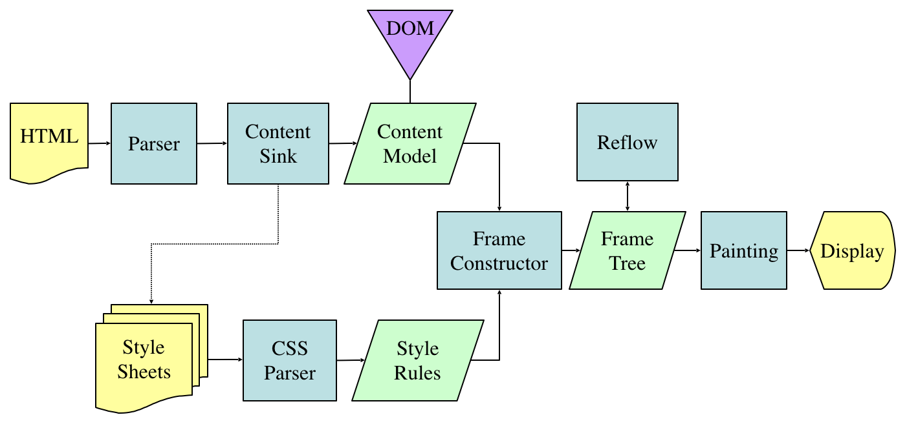

# Find Performance Problems

 

Askeing Yen &lt;fyen@mozilla.com&gt;

----

# Overview

----

## Gecko Overview

(from "How Browsers Work")

----

## Timing Overview

(from W3C)

----

# Get Timing

----

## Web API

* Getting Performance Timing data by Web API
    * `var timing = window.performance.timing.toJSON();`
* The result:
    * `{"navigationStart":1460712678604,"unloadEventStart":0,
      "unloadEventEnd":0,"redirectStart":0,"redirectEnd":0,
      "fetchStart":1460712678610,"domainLookupStart":
       ... }`

----

## Visualization

----

# Find the Scope

from domLoading to loadEventEnd

----

## By Add-On SDK

* Page-Mod
    * Run scripts in the context of web pages
    * Controls the point during document load
        * "start"
        * "ready" 
        * "end"

----

(from [profile](https://cleopatra.io/#report=f78ac305c786a22f525b9558ca5360f085f45ff4))

----

## By Customize Gecko

* Add `PROFILER_LABEL`
    * they are only recorded if a sample is collected while it is active
* Add `PROFILER_MARKER`
    * they will always be collected

----

(from [profile](https://cleopatra.io/#report=40a1eeceab5d53575fd1254444b5da29549de3a7&filter=%5B%7B%22type%22%3A%22RangeSampleFilter%22,%22start%22%3A225708,%22end%22%3A229337%7D%5D&selection=0,1,260))

----

## Find the Modules/Functions

Using this [profile](https://cleopatra.io/#report=40a1eeceab5d53575fd1254444b5da29549de3a7&filter=%5B%7B%22type%22%3A%22RangeSampleFilter%22,%22start%22%3A225708,%22end%22%3A229337%7D%5D&selection=0,1,260) as example.

* [`nsInputStreamPump::OnStateStop`](https://dxr.mozilla.org/mozilla-central/source/netwerk/base/nsInputStreamPump.cpp#670)
    * [`nsHttpChannel::OnStopRequest`](https://dxr.mozilla.org/mozilla-central/source/netwerk/protocol/http/nsHttpChannel.cpp#5979)

* [`nsHtml5TreeOpExecutor::RunFlushLoop`](https://dxr.mozilla.org/mozilla-central/source/parser/html/nsHtml5TreeOpExecutor.cpp#344)
    * [`nsJSUtils::EvaluateString`](https://dxr.mozilla.org/mozilla-central/source/dom/base/nsJSUtils.cpp#129)

----

## Reference

* [How Browsers Work](http://www.html5rocks.com/en/tutorials/internals/howbrowserswork/)
* [Gecko Overview](https://wiki.mozilla.org/Gecko:Overview)
* [Navigation Timing](https://www.w3.org/TR/navigation-timing/)
* [Timing Visualization](http://askeing.github.io/D3_performance_chart/)
* [Add-On SDK](https://developer.mozilla.org/en-US/Add-ons/SDK)
* [Profiling with the built-in profiler](https://developer.mozilla.org/en-US/docs/Mozilla/Performance/Profiling_with_the_Built-in_Profiler)
